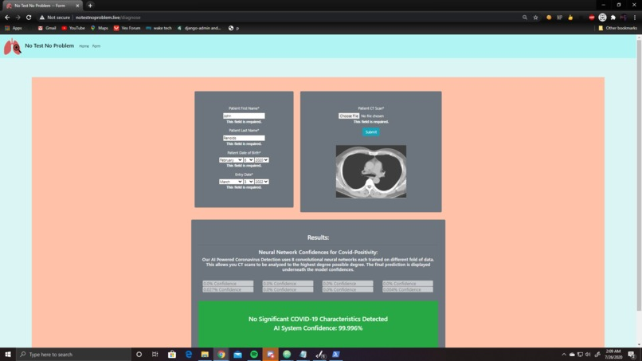

# NoTestNoProblem
A link to our devpost submission can be found here: https://devpost.com/software/no-test-no-problem

## Inspiration
With COVID-19 tests being carefully rationed out and there being multiple scarcities, patients may not have access to a traditional test. Our software can diagnose a patient purely on a CT scan, eliminating the need for single use tests.
## What it does
Our web app has a form for submitting patient data and uploading a CT scan image. We then pass the pixel data to our server, which runs several Tensorflow models. We then take the average confidence of all the models, and return the prediction to the browser. 
## How I built it
We built 8 Deep Learning Models with Tensorflow and Keras that integrate convolutional neural network architecture and a K-Fold structure, in order to make best use of a limited dataset. Our model achieved nearly 90% accuracy, allowing hospitals to use this as a tool to diagnose patients when resources are limited.
## Challenges I ran into
Over the course of this hackathon we were able to create a data model which achieves nearly 90% accuracy, one issue we had was not having a powerful enough processing unit to train the model from the start of the competition. We started using a NVIDIA V100 GPU to train the model. Given a better processing unit from the start and more time we would've been able to achieve greater accuracy, however we still manage ~90%.
## Accomplishments that I'm proud of
We used a NVIDIA V100 Graphics Processing Unit on Google Cloud Platform in order to train our models. We were also able to finish this entire project in 24 hours.
## What I learned
During the course of this hackathon we were able to learn and use Django to correctly link up the website wherein a user has to upload a CT Scan to the back-end data model which can predict whether a patient has Covid-19 or not. 
## What's next for No Test No Problem
We plan to add a database structure to hold patient and prediction data. We hope that this functionality will make our app more appealing to healthcare professionals.

